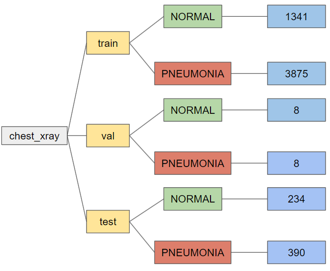
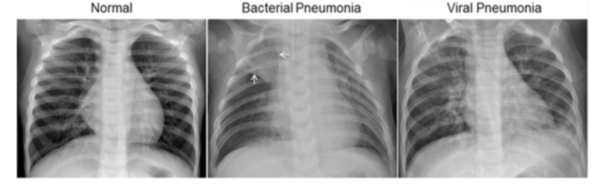
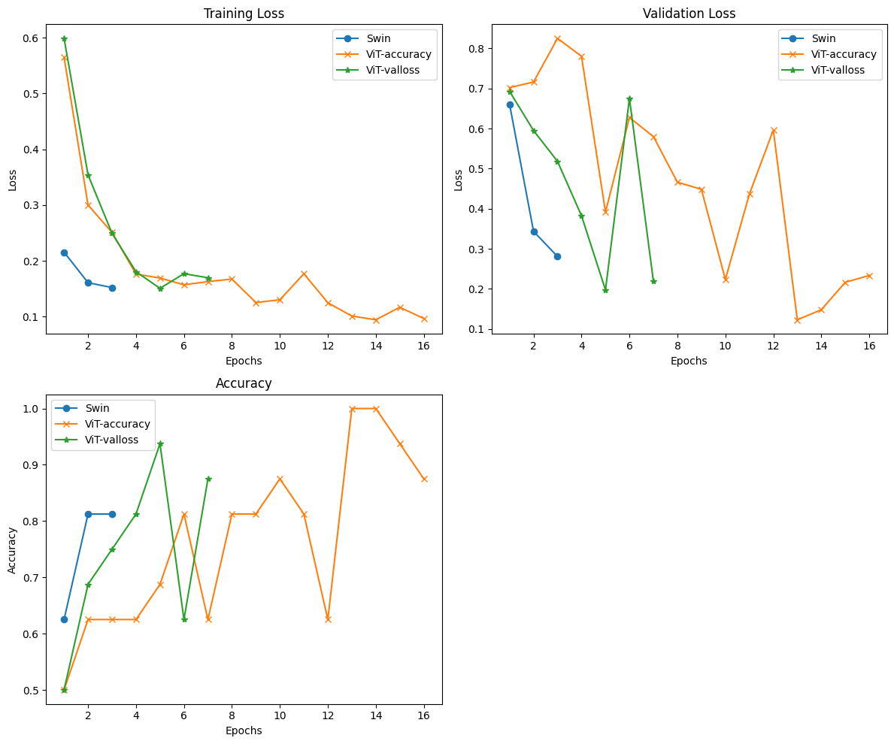

.. These are examples of badges you might want to add to your README:
   please update the URLs accordingly

    .. image:: https://api.cirrus-ci.com/github/<USER>/chest.svg?branch=main
        :alt: Built Status
        :target: https://cirrus-ci.com/github/<USER>/chest
    .. image:: https://readthedocs.org/projects/chest/badge/?version=latest
        :alt: ReadTheDocs
        :target: https://chest.readthedocs.io/en/stable/
    .. image:: https://img.shields.io/coveralls/github/<USER>/chest/main.svg
        :alt: Coveralls
        :target: https://coveralls.io/r/<USER>/chest
    .. image:: https://img.shields.io/pypi/v/chest.svg
        :alt: PyPI-Server
        :target: https://pypi.org/project/chest/
    .. image:: https://img.shields.io/conda/vn/conda-forge/chest.svg
        :alt: Conda-Forge
        :target: https://anaconda.org/conda-forge/chest
    .. image:: https://pepy.tech/badge/chest/month
        :alt: Monthly Downloads
        :target: https://pepy.tech/project/chest
    .. image:: https://img.shields.io/twitter/url/http/shields.io.svg?style=social&label=Twitter
        :alt: Twitter
        :target: https://twitter.com/chest

.. image:: https://img.shields.io/badge/-PyScaffold-005CA0?logo=pyscaffold
    :alt: Project generated with PyScaffold
    :target: https://pyscaffold.org/

|

=====
X-Ray Chest Pneumonia
=====

ViT transformer models to detect pneumonia in chest X-ray image 

.. _pyscaffold-notes:

Note
====

Set up an environment, and to install all packages: ``pip install -r requirements.txt``

=====
Data visualization 
=====

Dataset visualization can be found at ``src/data_visualization/data_visualization.ipynb``

For **interactive plot**, do: ``panel serve src/data_visualization/interactive_plot.py --dev`` and you can find the link at line ``Bokeh app running at: http://localhost:####/interactive_plot``

Data augmentation visualization can be found at ``src/analysis/Transformation_visualization.ipynb``

=====
ViT-accuracy and Vit-valloss
=====

.. image:: imgs/vit_figure.png

**Vit-accuracy** is trained at ``src/model/vit.ipynb``

The model can also be found at **huggingface.co/Towen/vit-base-patch16-224-in21k-finetuned**

**Vit-accuracy** is trained at ``src/model/vit_earlystop.ipynb``

The model can also be found at **huggingface.co/Towen/vit-base-patch16-224-in21k-finetuned-earlystop**

To use those pre-trained models, go to ``src/analysis/Inference.ipynb`` and change the model name

=====
Results
=====

The performance result can be found at ``src/analysis/Plots.ipynb``

Heatmap of the feature map of the model can be found at ``src/analysis/Fail_analysis.ipynb``, but it is incomplete
